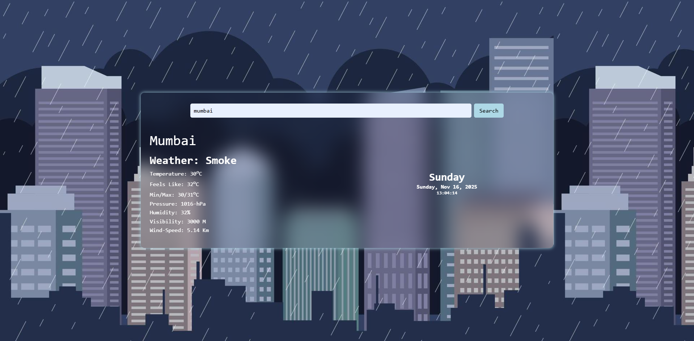

# 🌦️ Weather-Forecast App

A clean, simple weather forecast web application built with HTML, CSS, and JavaScript. This app allows users to search for a city and get real-time weather data, including temperature, humidity, wind speed, and more. It features a modern, "glassmorphism" UI with a live-updating date and time clock.

-----

## Preview


-----

## ✨ Features

  * **Real-Time Weather Data:** Get the current weather for any city in the world.
  * **City Search:** Simple and intuitive input field to search for any city.
  * **Detailed Information:** Displays a comprehensive set of data:
      * Temperature (in Celsius)
      * "Feels Like" Temperature
      * Min / Max Temperature
      * Weather Condition (e.g., "Clouds," "Rain")
      * Humidity
      * Pressure
      * Visibility
      * Wind Speed
  * **Live Clock:** A dynamic clock that shows the current day, date, and time, updating every second.
  * **Modern UI:** A responsive, blurred-backdrop (glassmorphism) design that looks great.

-----

## 🛠️ Technologies Used

  * **HTML5:** For the basic structure and content of the app.
  * **CSS3:** For all styling, including the grid layout and glassmorphism effect.
  * **JavaScript (ES6+):** For all logic, including:
      * `async/await` for asynchronous API calls.
      * The `fetch()` API to get data from OpenWeatherMap.
      * DOM manipulation to display the data and update the clock.
  * **OpenWeatherMap API:** Used as the source for all weather data.

-----

## 🚀 How to Use

To run this project locally, follow these steps:

1.  **Clone the repository (or download the files):**

    ```bash
    git clone https://github.com/your-username/your-repo-name.git
    ```

2.  **Get your own API Key:**

      * Sign up for a free account at [OpenWeatherMap](https://openweathermap.org/api).
      * Navigate to your dashboard and get your unique API key.

3.  **Update `script.js`:**

      * Open the `script.js` file.
      * Find this line:
        ```javascript
        const apikey = "your-api-key";
        ```
      * Replace the placeholder key with **your own API key**.

4.  **Open in your browser:**

      * Simply open the `index.html` file in your favorite web browser.
      * You can now search for any city\!

-----

## 📄 License

This project is open-source. You can use [MIT License] or another license if you choose.
